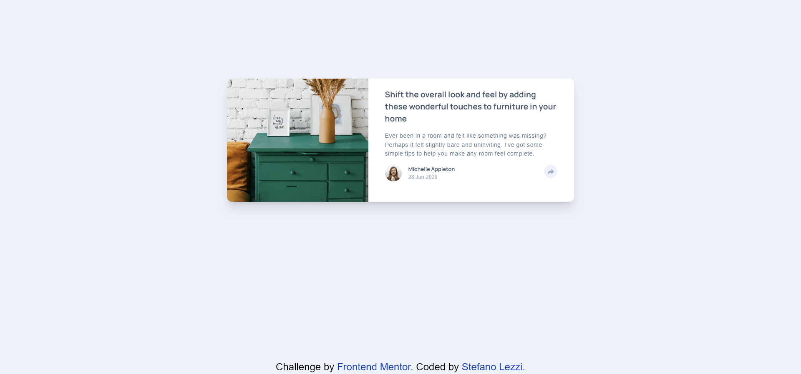
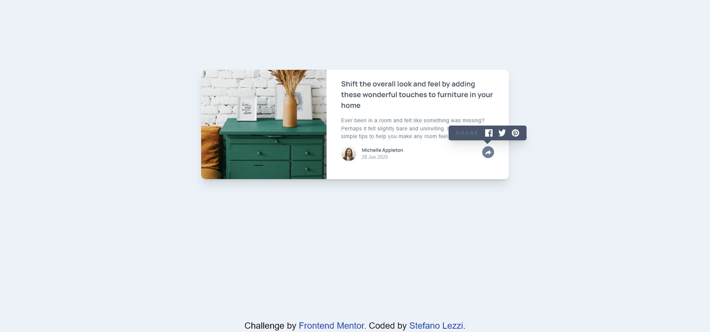
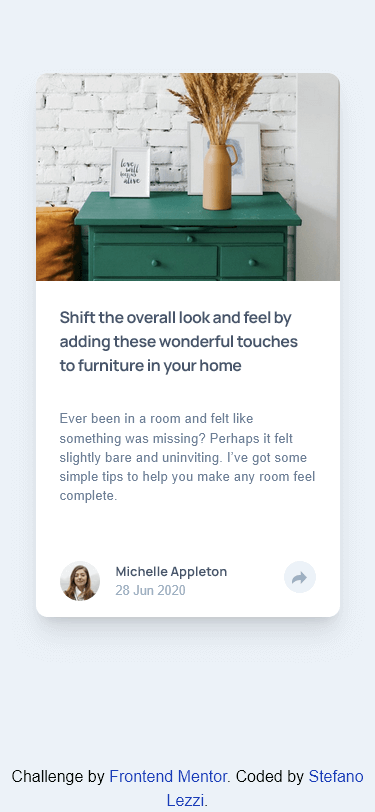
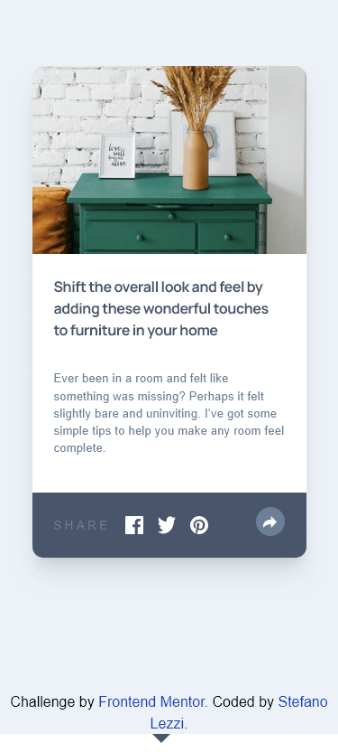

# Frontend Mentor - Article preview component solution

This is a solution to the [Article preview component challenge on Frontend Mentor](https://www.frontendmentor.io/challenges/article-preview-component-dYBN_pYFT). Frontend Mentor challenges help you improve your coding skills by building realistic projects.

## Table of contents

- [Overview](#overview)
  - [The challenge](#the-challenge)
  - [Screenshot](#screenshot)
  - [Links](#links)
- [My process](#my-process)
  - [Built with](#built-with)
  - [What I learned](#what-i-learned)
  - [Useful resources](#useful-resources)
- [Author](#author)

## Overview

### The challenge

Users should be able to:

- View the optimal layout for the component depending on their device's screen size
- See the social media share links when they click the share icon

### Screenshot

### Links

- Solution URL: [Git hub](https://github.com/Steno-95/article-preview-component)
- Live Site URL: [Netlify](https://article-preview-component-f-m.netlify.app)

## My process

### Built with

- Semantic HTML5 markup
- CSS custom properties
- Flexbox
- Mobile-first workflow
- [React](https://reactjs.org/) - JS library
- [Tailwindcss](https://tailwindcss.com/) - Framework for Styles

### What I learned

I didn't know how to make the arrow pointer for the SHARE popup, found my answer on stack overflow and ended up to be quite simple!

`element:before {
    content: "";
    position: absolute;
    top: 50%;
    margin-top: -15px;
    left:-30px;
    border: solid 15px transparent;
    border-right-color: #FFF;
    z-index: 1;
}`

### Useful resources

- [Stack Overflow](https://stackoverflow.com/questions/6972191/how-to-make-a-box-with-arrow-in-css) - As mentioned above i didn't know how to actually make an arrow with css, and found this nice solution on stack overflow.

## Author

- Website - [Stefano Lezzi](https://github.com/Steno-95)
- Frontend Mentor - [@Steno-95](https://www.frontendmentor.io/profile/Steno-95)
